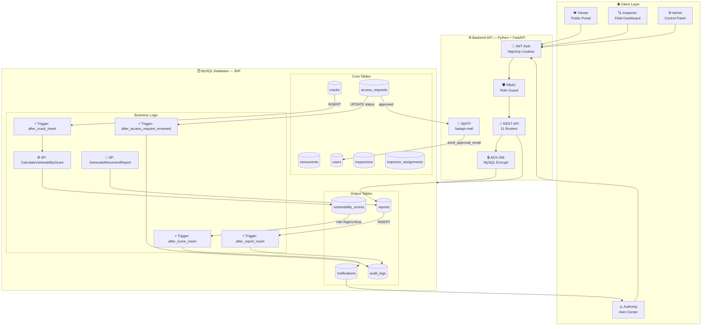
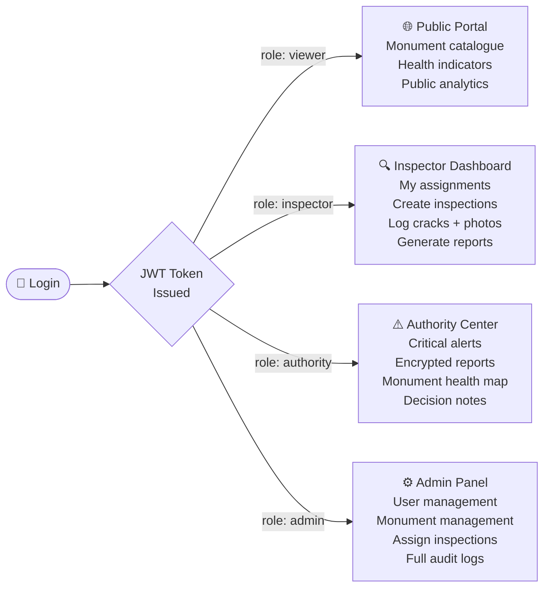
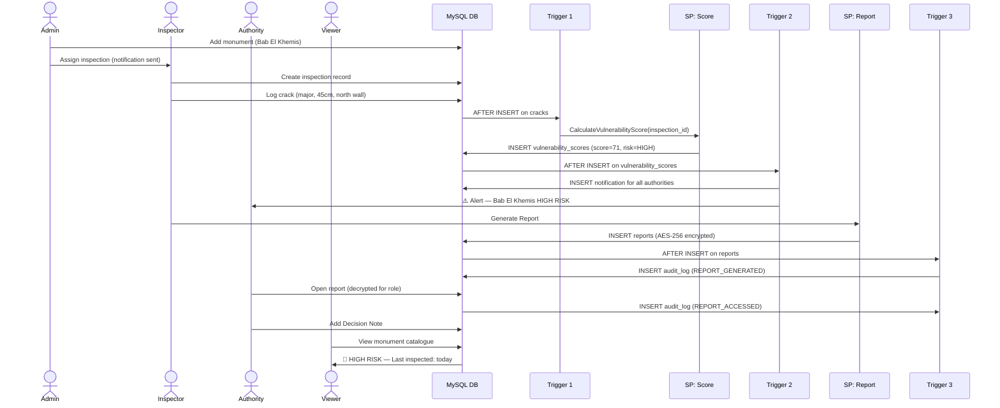
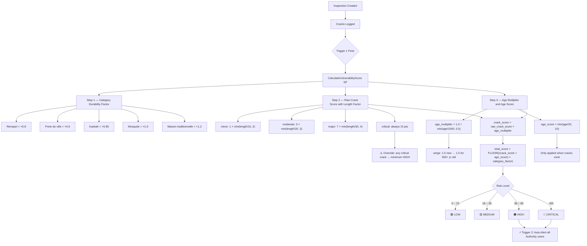
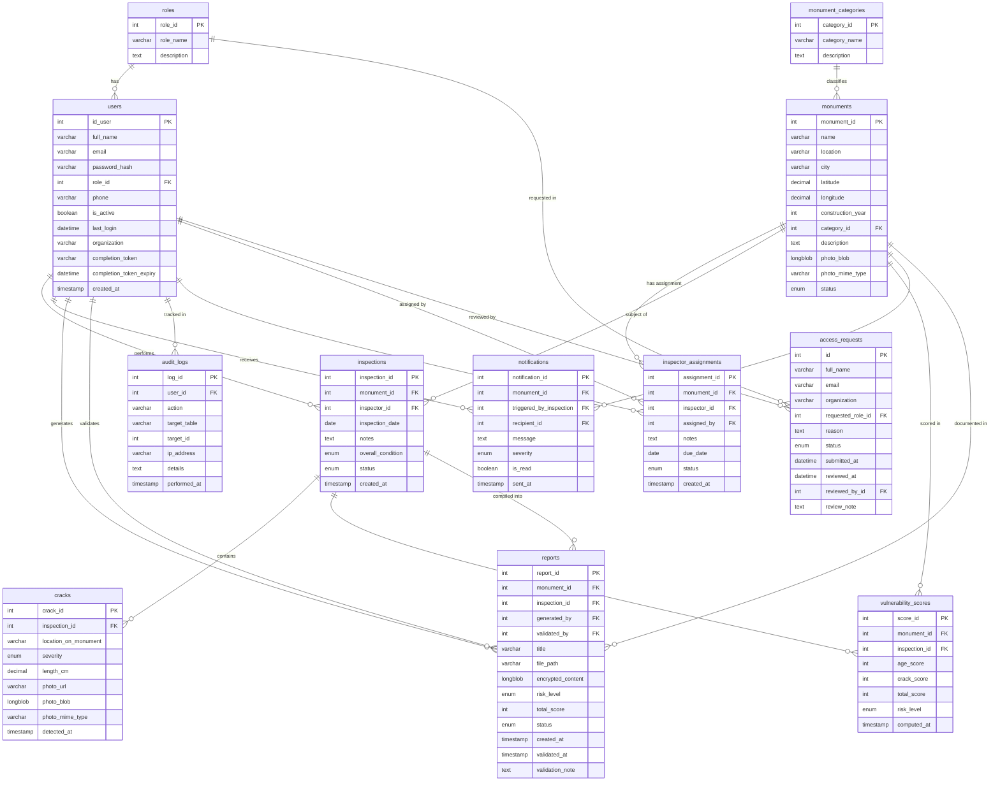
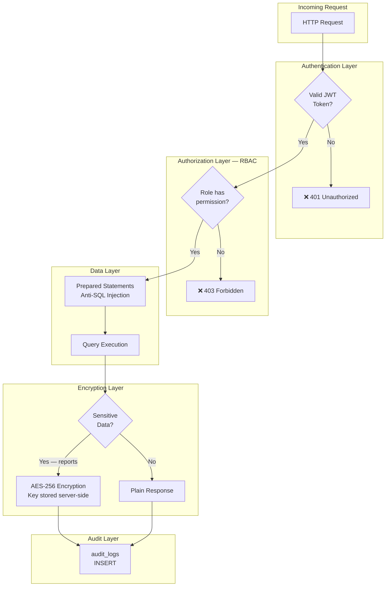

<div align="center">

<br/>
 
```
      ████████╗ █████╗ ██████╗  ██████╗ ██╗   ██╗██████╗  █████╗ ███╗   ██╗████████╗
      ╚══██╔══╝██╔══██╗██╔══██╗██╔═══██╗██║   ██║██╔══██╗██╔══██╗████╗  ██║╚══██╔══╝
         ██║   ███████║██████╔╝██║   ██║██║   ██║██║  ██║███████║██╔██╗ ██║   ██║   
         ██║   ██╔══██║██╔══██╗██║   ██║██║   ██║██║  ██║██╔══██║██║╚██╗██║   ██║   
         ██║   ██║  ██║██║  ██║╚██████╔╝╚██████╔╝██████╔╝██║  ██║██║ ╚████║   ██║   
         ╚═╝   ╚═╝  ╚═╝╚═╝  ╚═╝ ╚═════╝  ╚═════╝ ╚═════╝ ╚═╝  ╚═╝╚═╝  ╚═══╝   ╚═╝   
```

# 🏛️ HERITAGE SHIELD
### *Protecting the Soul of Taroudant — One Monument at a Time*

<br/>

[](.)
[](.)
[](.)
[](.)
[](.)
[](.)

<br/>

> *"Taroudant — the grandmother of Marrakech — holds within its ancient walls*
> *over seven centuries of Moroccan civilization. This platform exists*
> *to ensure those walls stand for seven centuries more."*

<br/>

</div>

---

## 🌍 The City We Protect

<div align="center">

| | |
|:---:|:---:|
|  |  |
| *The ancient ramparts of Taroudant — 7.5km of earthen walls* | *The historic medina, one of Morocco's most preserved* |

</div>

**Taroudant** is a walled city in Morocco's Souss Valley, nestled between the High Atlas and Anti-Atlas mountains. Its iconic **ochre ramparts**, stretching over **7.5 kilometers**, date back to the **16th century Saadian dynasty**. The city is home to mosques, fountains, souks, and gates — all classified as irreplaceable cultural heritage.

Yet these structures are **aging**. Cracks form. Walls erode. Foundations weaken. And until now, there has been **no automated system** to detect, score, and alert authorities about the structural degradation of these monuments.

**That is the problem Taroudant Heritage Shield solves.**

---

## 💡 The Vision

```
Imagine a world where a crack in Bab El Khemis is detected on Monday,
scored automatically by Tuesday, and a restoration order is signed by Wednesday.

That is the world this platform builds.
```

Taroudant Heritage Shield is a **full-stack web application** that:

- 📍 **Catalogs** every monument and rampart of Taroudant with GPS coordinates, photos, and historical data
- 🔍 **Tracks** structural inspections performed by certified field experts
- 🧮 **Scores** vulnerability automatically using age + crack severity formulas via MySQL stored procedures
- 🚨 **Alerts** municipal authorities in real-time when critical risk is detected via database triggers
- 📄 **Generates** encrypted expert reports accessible only to authorized decision-makers
- 🌐 **Displays** a public monument health catalogue for citizens and researchers

---

## 🏗️ Project Structure — Two Teams, One Goal

This is an **academic comparative study**: the same system is built by two teams using different methodologies.

```
taroudant-heritage-shield/
│
├── 🤖 ai-team/                    # Built with AI assistance (Claude + Cursor)
│   ├── frontend/                  # React + Vite (TypeScript)
│   ├── backend/                   # Python + FastAPI + Uvicorn
│   │   ├── app/
│   │   │   ├── routers/           # 11 API routers (auth, monuments, etc.)
│   │   │   ├── services/          # auth_service, email_service, user_service
│   │   │   ├── models/            # Pydantic request/response models
│   │   │   ├── config.py          # Settings (pydantic-settings, .env)
│   │   │   ├── database.py        # MySQL connection pool
│   │   │   └── dependencies.py    # JWT + RBAC deps
│   │   ├── main.py                # FastAPI app + CORS + routers
│   │   ├── run.py                 # Uvicorn entrypoint
│   │   └── requirements.txt
│   ├── sql/                       # MySQL schema, procedures, triggers
│   └── documents/                 # Architecture docs & diagrams
│
└── 👥 team-without-ai/            # Built with traditional methods
    ├── frontend/                  # HTML / CSS / JS
    ├── backend/                   # PHP or Node.js
    ├── sql/                       # MySQL schema
    └── documents/                 # Architecture docs
```

| Dimension | 🤖 AI Team | 👥 Traditional Team |
|---|---|---|
| **Methodology** | Claude + Cursor assisted | Manual planning & coding |
| **Frontend** | React + Vite (TypeScript) | HTML / CSS / Vanilla JS |
| **Backend** | Python + FastAPI + Uvicorn | PHP / Node.js |
| **Database** | MySQL 3NF | MySQL 3NF |
| **Development Speed** | Measured | Measured |
| **Code Quality** | Evaluated | Evaluated |
| **Goal** | Build the same system | Build the same system |

> The comparison measures productivity, code quality, architecture decisions, and final output between AI-assisted and traditional development.

---

## 🎬 Project Demonstrations

Experience the results of both development methodologies through these video walkthroughs. These demos showcase the final application features, user interface, and the core heritage monitoring workflow.

<div align="center">

| 🤖 AI-Assisted Team (Modern) | 👥 Traditional Team (Classic) |
| :---: | :---: |
| [](INSERT_AI_TEAM_DRIVE_LINK_HERE) | [](https://drive.google.com/file/d/13IRdhkT1Bv3UKR-u5j6eU4ns7SKAFGsQ/view?usp=sharing) |
| *Showcasing high-speed React/FastAPI integration* | *Showcasing traditional development reliability* |

</div>

---

## 🗺️ System Architecture



---

## 👥 Role-Based Access Control (RBAC)



| Role | Created By | Key Permissions |
|---|---|---|
| 👁️ **Viewer** | Self-registration | Public catalogue, health indicators, public stats |
| 🔍 **Inspector** | Admin only | Inspections, crack logging, report generation |
| ⚠️ **Authority** | Admin only | Encrypted reports, alert center, decision notes |
| ⚙️ **Admin** | System init | Full access — users, monuments, assignments, audit |

---

## 🔄 Complete Workflow



---

## 🧮 Vulnerability Scoring Formula



---

## 🗄️ Database Schema — 3NF Normalized



---

## 🔐 Security Architecture



| Threat | Protection |
|---|---|
| 🔑 Unauthorized access | JWT stored in **httpOnly cookies** (access 60 min + refresh 7 days) |
| 🛡️ Privilege escalation | `require_role()` RBAC dependency on every protected route |
| 💉 SQL Injection | 100% parameterized queries via `mysql-connector-python` |
| 📄 Report data leaks | `AES_ENCRYPT` in MySQL — `encrypted_content` LONGBLOB, key never in DB |
| 🔓 Password theft | `bcrypt` hashing (rounds=12) — plain text never stored |
| 👁️ Untracked access | Every sensitive action logged in `audit_logs` via triggers + app |
| 📧 Account phishing | Single-use completion token (48 hr expiry) sent via SMTP (Gmail TLS) |

---

## 🧱 SQL Business Logic

### ⚙️ Stored Procedure 1 — `CalculateVulnerabilityScore`

```sql
-- Automatically called by Trigger 1 after each crack is logged
-- Weighted formula: crack severity × age multiplier × category factor
-- Step 1 — Crack severity weights (length-adjusted)
--   minor:    1  × min(length_cm / 10,  2)
--   moderate: 3  × min(length_cm / 20,  3)
--   major:    7  × min(length_cm / 30,  4)
--   critical: 15 (always maximum, length irrelevant)
-- Step 2 — Age multiplier: 1.0 + min(age_years / 1000, 0.5)
--   → 1.0 for new structures, up to 1.5 for 500+ year old ones
--   → applied only when cracks exist (old monument with no cracks = LOW)
-- Step 3 — Age score: min(age_years / 20, 10)  [capped at 10]
-- Step 4 — Category durability factor
--   Rempart 0.8 | Porte de ville 0.9 | Kasbah 0.85
--   Mosquée 1.0 | Maison traditionnelle 1.2 | Jardin 1.1
-- Step 5 — Final score
--   crack_score  = raw_crack_score × age_multiplier
--   total_score  = FLOOR((crack_score + age_score) × category_factor)
-- Override: any critical crack forces minimum HIGH risk
CALL CalculateVulnerabilityScore(inspection_id);
-- Output: INSERT into vulnerability_scores
```

**Risk level thresholds (post-formula):**

| Score Range | Risk Level |
|---|---|
| 0 – 15 | 🟢 LOW |
| 16 – 35 | 🟡 MEDIUM |
| 36 – 60 | 🟠 HIGH |
| 61+ | 🔴 CRITICAL |

### 📄 Stored Procedure 2 — `GenerateMonumentReport`

```sql
-- Called by inspector when field work is complete
-- Compiles all inspection data → builds French-language structured report
-- → AES-256 encrypts content → stores encrypted_content LONGBLOB in reports
CALL GenerateMonumentReport(monument_id, inspection_id, generated_by);
-- Output: INSERT into reports (encrypted_content, risk_level, total_score)
-- Returns: LAST_INSERT_ID() AS report_id
```

**Recommendations generated (French):**

| Risk Level | Recommendation |
|---|---|
| 🟢 LOW | Surveillance périodique recommandée |
| 🟡 MEDIUM | Inspection approfondie recommandée |
| 🟠 HIGH | Intervention urgente requise |
| 🔴 CRITICAL | DANGER: Fermeture et restauration immédiate |

### ⚡ Trigger Summary

| Trigger | Fires On | Action |
|---|---|---|
| `after_crack_insert` | INSERT on `cracks` | Calls `CalculateVulnerabilityScore` |
| `after_score_insert` | INSERT on `vulnerability_scores` | If HIGH/CRITICAL → INSERT notifications for all authority users |
| `after_report_insert` | INSERT on `reports` | INSERT into `audit_logs` (REPORT_GENERATED) |
| `after_access_request_reviewed` | UPDATE on `access_requests` (status change) | INSERT into `audit_logs` (APPROVED / REJECTED / PENDING) |

---

## 📁 SQL Files Structure

```
ai-team/sql/
├── 01_schema.sql                # 12 tables — roles, users, monument_categories,
│                                #   monuments, inspector_assignments, inspections,
│                                #   cracks, vulnerability_scores, notifications,
│                                #   reports, audit_logs, access_requests
│                                #   + roles seed + admin bootstrap
├── 02_stored_procedures.sql     # SP: CalculateVulnerabilityScore + GenerateMonumentReport
├── 03_triggers.sql              # 4 triggers (crack→score, score→notify,
│                                #             report→audit, access_request→audit)
├── 04_rbac_users.sql            # Roles, users, permissions
└── 05_seed_data.sql             # Sample Taroudant monuments data
```

---

## 🚀 Getting Started

### Prerequisites
```bash
Python >= 3.10
MySQL >= 8.0
Node.js >= 18.0.0   # frontend only
npm >= 9.0.0        # frontend only
```

### Installation

```bash
# 1. Clone the repository
git clone https://github.com/your-team/taroudant-heritage-shield.git
cd taroudant-heritage-shield/ai-team

# 2. Setup the database (run in order)
mysql -u root -p < sql/01_schema.sql
mysql -u root -p < sql/02_stored_procedures.sql
mysql -u root -p < sql/03_triggers.sql
mysql -u root -p < sql/04_rbac_users.sql
mysql -u root -p < sql/05_seed_data.sql

# 3. Configure backend environment
cd backend
copy .env.example .env
# Fill in DB credentials, JWT keys, and SMTP settings

# 4. Start the backend (Python + FastAPI)
python -m venv venv
venv\Scripts\activate        # Windows
pip install -r requirements.txt
python run.py               # Uvicorn on http://localhost:8000

# 5. Start the frontend (React + Vite)
cd ../frontend
npm install
npm run dev                 # Vite on http://localhost:5173
```

### Environment Variables

```env
# backend/.env
APP_ENV=development
APP_SECRET_KEY=your-secret-key-min-50-chars
FRONTEND_URL=http://localhost:5173

DB_HOST=127.0.0.1
DB_PORT=3308
DB_NAME=taroudant_heritage_shield
DB_USER=root
DB_PASSWORD=your_mysql_password

JWT_SECRET_KEY=your-jwt-secret-key-min-50-chars
JWT_ALGORITHM=HS256
JWT_ACCESS_EXPIRE_MINUTES=60
JWT_REFRESH_EXPIRE_DAYS=7

COOKIE_SECURE=False
COOKIE_SAMESITE=lax

# SMTP (Gmail App Password recommended)
SMTP_HOST=smtp.gmail.com
SMTP_PORT=587
SMTP_USER=your_email@gmail.com
SMTP_PASSWORD=your_app_password
SMTP_FROM=noreply@heritage-taroudant.ma
```

---

## 📊 Pages & Features

### 🌐 Public Routes (no login required)

| Route | Description |
|---|---|
| `/` | Home — Taroudant heritage story, stats, call to action |
| `/monuments` | Public catalogue with risk indicators 🟢🟡🔴 |
| `/monument/:id` | Single monument — history, photos, public risk status |
| `/about` | About the project and academic context |
| `/map` | Color-coded monument health map (public) |
| `/login` | Login form |
| `/complete-account?token=…` | One-time account completion page (approved users) |

### 🔐 Protected Routes (any authenticated user)

| Route | Description |
|---|---|
| `/dashboard` | Role-based router → Inspector / Authority / Admin dashboard |
| `/analytics` | Stats — monuments by risk level, inspection activity |
| `/risk-lab` | Interactive vulnerability score simulator |
| `/architecture` | System architecture diagram viewer |

### 🔍 Inspector + Admin

| Route | Description |
|---|---|
| `/inspect/new` | Create a new inspection for a monument |
| `/inspect/:id` | View/edit inspection — log cracks, view score |

### ⚠️ Authority + Admin

| Route | Description |
|---|---|
| `/inspection/:id` | Read-only inspection view (authority review mode) |

### ⚙️ Admin Only

| Route | Description |
|---|---|
| `/admin/users` | User management — view, activate/deactivate accounts |
| `/admin/monuments` | Monument management — add, edit, delete monuments |

---

## 👨‍💻 Academic Context

This project is developed as part of an academic curriculum requiring:

| Requirement | Implementation |
|---|---|
| ✅ Relational DB — MySQL 3NF | 12 normalized tables |
| ✅ Minimum 2 Stored Procedures | `CalculateVulnerabilityScore` + `GenerateMonumentReport` |
| ✅ Minimum 3 Triggers | **4 triggers** — crack→score, score→notify, report→audit, access_request→audit |
| ✅ Frontend Interface | React + Vite (TypeScript) — animated, role-based dashboards |
| ✅ Backend API | Python + FastAPI — 11 routers, Uvicorn ASGI server |
| ✅ RBAC Security | httpOnly cookie JWT + `require_role()` dep on all protected routes |
| ✅ Anti-SQL Injection | 100% parameterized queries (`mysql-connector-python`) |
| ✅ Report Encryption | `AES_ENCRYPT` in MySQL — `encrypted_content` LONGBLOB in `reports` |
| ✅ Email Notifications | SMTP via `fastapi-mail` — approval/rejection emails with completion link |
| ✅ Access Request Workflow | `access_requests` table + admin review panel + 48 hr one-use token |
| ✅ AI vs Traditional Comparison | Two parallel development teams |

---

## 🏛️ Monuments of Taroudant — Initial Dataset

The seed data includes Taroudant's most significant heritage sites:

| Monument | Category | Est. Built | Location |
|---|---|---|---|
| 🏰 Remparts de Taroudant | Rampart | 16th century | Encircling the medina |
| 🚪 Bab El Khemis | City Gate | 16th century | North entrance |
| 🚪 Bab Zorgane | City Gate | 16th century | East entrance |
| 🕌 Grande Mosquée | Mosque | 14th century | Medina center |
| ⛲ Place Assarag | Historic Square | 19th century | City center |
| 🏰 Kasbah de Taroudant | Fortress | 16th century | Southwest medina |

---

## 📜 License & Academic Use

This project is developed for **academic purposes** as part of a database systems and web development curriculum. All monument data and historical references are based on publicly available cultural heritage documentation.

---

<div align="center">

<br/>

*Built with purpose. Guided by history. Powered by code.*

**🏛️ Taroudant Heritage Shield**

`Agadir — Souss-Massa — Morocco — 2026`

<br/>


</div>
