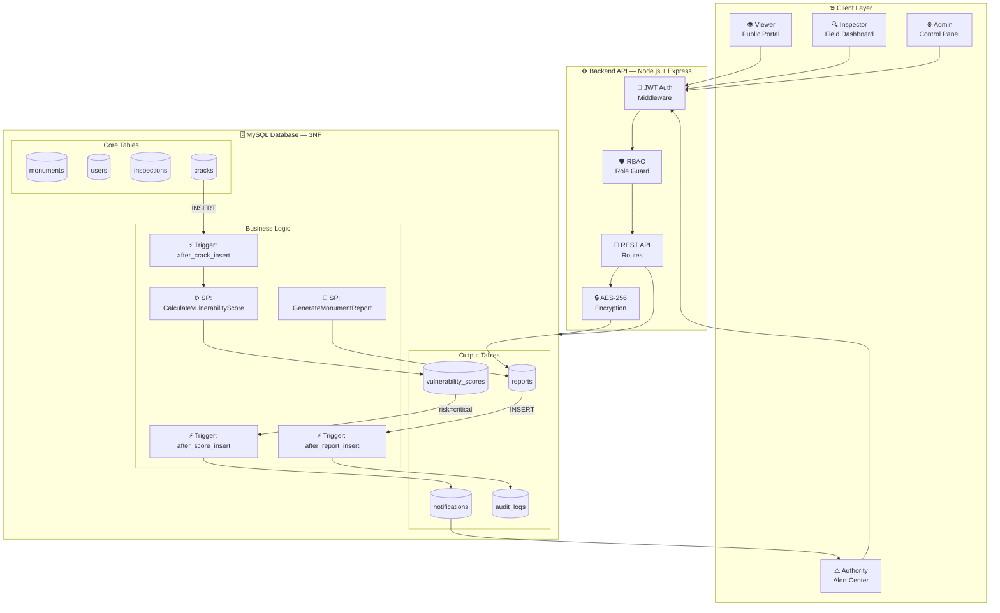
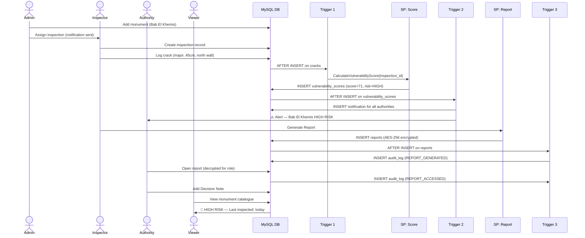
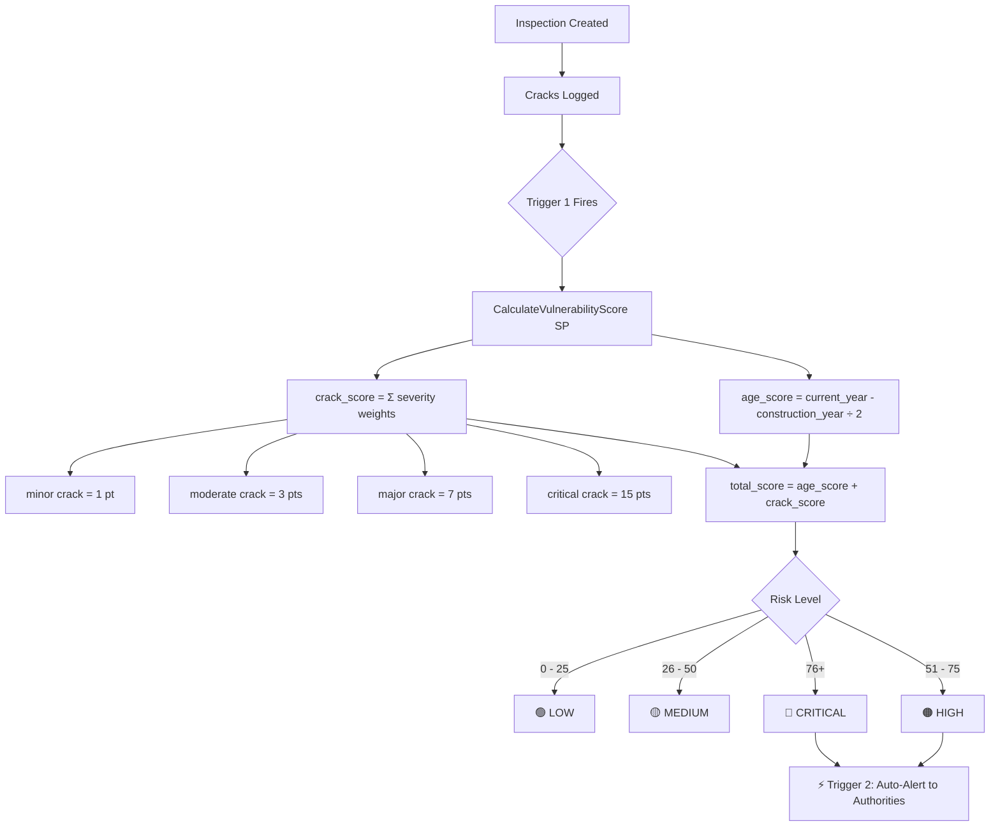
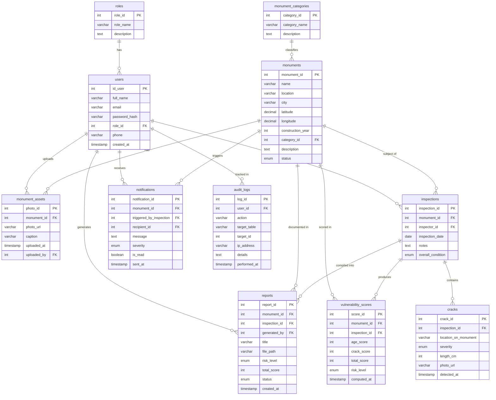
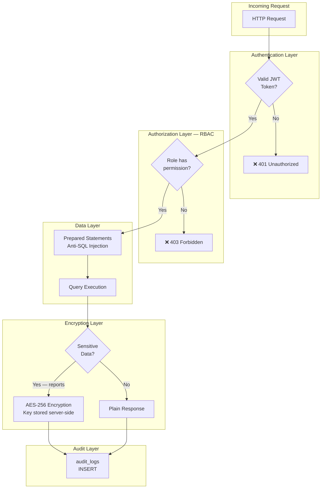

<div align="center">

<br/>

```
      ████████╗ █████╗ ██████╗  ██████╗ ██╗   ██╗██████╗  █████╗ ███╗   ██╗████████╗
      ╚══██╔══╝██╔══██╗██╔══██╗██╔═══██╗██║   ██║██╔══██╗██╔══██╗████╗  ██║╚══██╔══╝
         ██║   ███████║██████╔╝██║   ██║██║   ██║██║  ██║███████║██╔██╗ ██║   ██║   
         ██║   ██╔══██║██╔══██╗██║   ██║██║   ██║██║  ██║██╔══██║██║╚██╗██║   ██║   
         ██║   ██║  ██║██║  ██║╚██████╔╝╚██████╔╝██████╔╝██║  ██║██║ ╚████║   ██║   
         ╚═╝   ╚═╝  ╚═╝╚═╝  ╚═╝ ╚═════╝  ╚═════╝ ╚═════╝ ╚═╝  ╚═╝╚═╝  ╚═══╝   ╚═╝   
```

# 🏛️ HERITAGE SHIELD
### *Protecting the Soul of Taroudant — One Monument at a Time*

<br/>

[](.)
[](.)
[](.)
[](.)
[](.)
[](.)

<br/>

> *"Taroudant — the grandmother of Marrakech — holds within its ancient walls*
> *over seven centuries of Moroccan civilization. This platform exists*
> *to ensure those walls stand for seven centuries more."*

<br/>

</div>

---

## 🌍 The City We Protect

<div align="center">

| | |
|:---:|:---:|
|  |  |
| *The ancient ramparts of Taroudant — 7.5km of earthen walls* | *The historic medina, one of Morocco's most preserved* |

</div>

**Taroudant** is a walled city in Morocco's Souss Valley, nestled between the High Atlas and Anti-Atlas mountains. Its iconic **ochre ramparts**, stretching over **7.5 kilometers**, date back to the **16th century Saadian dynasty**. The city is home to mosques, fountains, souks, and gates — all classified as irreplaceable cultural heritage.

Yet these structures are **aging**. Cracks form. Walls erode. Foundations weaken. And until now, there has been **no automated system** to detect, score, and alert authorities about the structural degradation of these monuments.

**That is the problem Taroudant Heritage Shield solves.**

---

## 💡 The Vision

```
Imagine a world where a crack in Bab El Khemis is detected on Monday,
scored automatically by Tuesday, and a restoration order is signed by Wednesday.

That is the world this platform builds.
```

Taroudant Heritage Shield is a **full-stack web application** that:

- 📍 **Catalogs** every monument and rampart of Taroudant with GPS coordinates, photos, and historical data
- 🔍 **Tracks** structural inspections performed by certified field experts
- 🧮 **Scores** vulnerability automatically using age + crack severity formulas via MySQL stored procedures
- 🚨 **Alerts** municipal authorities in real-time when critical risk is detected via database triggers
- 📄 **Generates** encrypted expert reports accessible only to authorized decision-makers
- 🌐 **Displays** a public monument health catalogue for citizens and researchers

---

## 🏗️ Project Structure — Two Teams, One Goal

This is an **academic comparative study**: the same system is built by two teams using different methodologies.

```
taroudant-heritage-shield/
│
├── 🤖 ai-team/                    # Built with AI assistance (Claude + Cursor)
│   ├── frontend/                  # React + Vite application
│   ├── backend/                   # Node.js + Express API
│   ├── sql/                       # MySQL schema, procedures, triggers
│   └── documents/                 # Architecture docs & diagrams
│
└── 👥 team-without-ai/            # Built with traditional methods
    ├── frontend/                  # HTML / CSS / JS
    ├── backend/                   # PHP or Node.js
    ├── sql/                       # MySQL schema
    └── documents/                 # Architecture docs
```

| Dimension | 🤖 AI Team | 👥 Traditional Team |
|---|---|---|
| **Methodology** | Claude + Cursor assisted | Manual planning & coding |
| **Frontend** | React + Vite | HTML / CSS / Vanilla JS |
| **Backend** | Node.js + Express | PHP / Node.js |
| **Database** | MySQL 3NF | MySQL 3NF |
| **Development Speed** | Measured | Measured |
| **Code Quality** | Evaluated | Evaluated |
| **Goal** | Build the same system | Build the same system |

> The comparison measures productivity, code quality, architecture decisions, and final output between AI-assisted and traditional development.

---

## 🗺️ System Architecture



---

## 👥 Role-Based Access Control (RBAC)


| Role | Created By | Key Permissions |
|---|---|---|
| 👁️ **Viewer** | Self-registration | Public catalogue, health indicators, public stats |
| 🔍 **Inspector** | Admin only | Inspections, crack logging, report generation |
| ⚠️ **Authority** | Admin only | Encrypted reports, alert center, decision notes |
| ⚙️ **Admin** | System init | Full access — users, monuments, assignments, audit |

---

## 🔄 Complete Workflow



---

## 🧮 Vulnerability Scoring Formula



---

## 🗄️ Database Schema — 3NF Normalized



---

## 🔐 Security Architecture



| Threat | Protection |
|---|---|
| 🔑 Unauthorized access | JWT tokens with expiry + role embedded |
| 🛡️ Privilege escalation | RBAC middleware on every API route |
| 💉 SQL Injection | 100% prepared statements — zero string concatenation |
| 📄 Report data leaks | AES-256-CBC encryption — key never stored in DB |
| 🔓 Password theft | bcrypt hashing — plain text never stored |
| 👁️ Untracked access | Every sensitive action logged in audit_logs |

---

## 🧱 SQL Business Logic

### ⚙️ Stored Procedure 1 — `CalculateVulnerabilityScore`

```sql
-- Automatically called by Trigger 1 after each crack is logged
-- Computes risk level from monument age + crack severity weights
CALL CalculateVulnerabilityScore(inspection_id);
-- Output: INSERT into vulnerability_scores
```

### 📄 Stored Procedure 2 — `GenerateMonumentReport`

```sql
-- Called by inspector when field work is complete
-- Compiles all inspection data → encrypts → saves report
CALL GenerateMonumentReport(monument_id, inspection_id, generated_by);
-- Output: INSERT into reports (encrypted content)
```

### ⚡ Trigger Summary

| Trigger | Fires On | Action |
|---|---|---|
| `after_crack_insert` | INSERT on `cracks` | Calls `CalculateVulnerabilityScore` |
| `after_score_insert` | INSERT on `vulnerability_scores` | If HIGH/CRITICAL → INSERT notifications |
| `after_report_insert` | INSERT on `reports` | INSERT into `audit_logs` |

---

## 📁 SQL Files Structure

```
ai-team/sql/
├── 01_schema.sql                # All CREATE TABLE statements
├── 02_stored_procedures.sql     # SP: Score + Report
├── 03_triggers.sql              # 3 triggers
├── 04_rbac_users.sql            # Roles, users, permissions
└── 05_seed_data.sql             # Sample Taroudant monuments data
```

---

## 🚀 Getting Started

### Prerequisites
```bash
node >= 18.0.0
mysql >= 8.0
npm >= 9.0.0
```

### Installation

```bash
# 1. Clone the repository
git clone https://github.com/your-team/taroudant-heritage-shield.git
cd taroudant-heritage-shield/ai-team

# 2. Setup the database
mysql -u root -p < sql/01_schema.sql
mysql -u root -p < sql/02_stored_procedures.sql
mysql -u root -p < sql/03_triggers.sql
mysql -u root -p < sql/04_rbac_users.sql
mysql -u root -p < sql/05_seed_data.sql

# 3. Configure environment
cd backend
cp .env.example .env
# Edit .env with your MySQL credentials and JWT secret

# 4. Start backend
npm install
npm run dev

# 5. Start frontend
cd ../frontend
npm install
npm run dev
```

### Environment Variables

```env
# backend/.env
DB_HOST=localhost
DB_USER=your_mysql_user
DB_PASSWORD=your_mysql_password
DB_NAME=taroudant_heritage_shield
JWT_SECRET=your_super_secret_jwt_key
AES_ENCRYPTION_KEY=your_32_char_aes_key
PORT=3001
```

---

## 📊 Pages & Features

| Page | Role | Description |
|---|---|---|
| `/` | All | Home — Taroudant heritage story + monument map |
| `/monuments` | All | Public catalogue with health indicators 🟢🟡🔴 |
| `/monuments/:id` | All | Single monument — history, photos, public status |
| `/analytics` | All | Public stats — monuments by risk level |
| `/dashboard` | Inspector | Assignments, notifications, inspection forms |
| `/inspect/:id` | Inspector | Create inspection + log cracks + upload photos |
| `/reports` | Inspector / Admin | Generated reports list |
| `/alerts` | Authority | Critical notification center |
| `/map` | Authority | Color-coded monument health map |
| `/users` | Admin | Create and manage user accounts |
| `/assignments` | Admin | Assign inspectors to monuments |
| `/system` | Admin | Audit logs, trigger history, system health |

---

## 👨‍💻 Academic Context

This project is developed as part of an academic curriculum requiring:

| Requirement | Implementation |
|---|---|
| ✅ Relational DB — MySQL 3NF | 11 normalized tables |
| ✅ Minimum 2 Stored Procedures | `CalculateVulnerabilityScore` + `GenerateMonumentReport` |
| ✅ Minimum 3 Triggers | `after_crack_insert`, `after_score_insert`, `after_report_insert` |
| ✅ Frontend Interface | React + Vite — role-based dashboards |
| ✅ RBAC Security | JWT + role middleware on all routes |
| ✅ Anti-SQL Injection | 100% prepared statements |
| ✅ Report Encryption | AES-256-CBC — sensitive structural data |
| ✅ AI vs Traditional Comparison | Two parallel development teams |

---

## 🏛️ Monuments of Taroudant — Initial Dataset

The seed data includes Taroudant's most significant heritage sites:

| Monument | Category | Est. Built | Location |
|---|---|---|---|
| 🏰 Remparts de Taroudant | Rampart | 16th century | Encircling the medina |
| 🚪 Bab El Khemis | City Gate | 16th century | North entrance |
| 🚪 Bab Zorgane | City Gate | 16th century | East entrance |
| 🕌 Grande Mosquée | Mosque | 14th century | Medina center |
| ⛲ Place Assarag | Historic Square | 19th century | City center |
| 🏰 Kasbah de Taroudant | Fortress | 16th century | Southwest medina |

---

## 📜 License & Academic Use

This project is developed for **academic purposes** as part of a database systems and web development curriculum. All monument data and historical references are based on publicly available cultural heritage documentation.

---

<div align="center">

<br/>

*Built with purpose. Guided by history. Powered by code.*

**🏛️ Taroudant Heritage Shield**

`Agadir — Souss-Massa — Morocco — 2026`

<br/>


</div>
