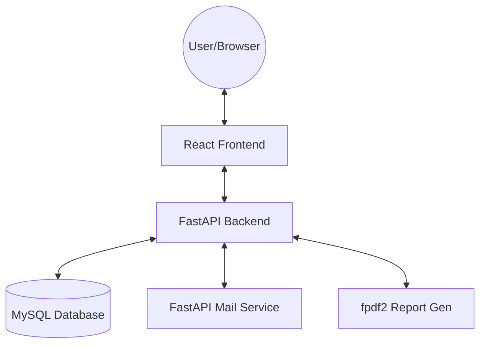

# Taroudant Heritage Shield — Strategic Component Reference Guide

This document serves as the authoritative technical reference for the **Taroudant Heritage Shield** project, a full-stack platform for monitoring and protecting the historical ramparts and monuments of Taroudant.

---

### 1️⃣ Project Overview

**Taroudant Heritage Shield** is a digital monitoring system designed to bridge the gap between field inspectors and heritage authorities. It enables real-time logging of structural damage (cracks, erosion), automated vulnerability scoring, and formal report generation for conservation decision-making.

#### High-Level Architecture


#### Tech-Stack
| Component | Technology | Version |
|-----------|------------|---------|
| **Frontend** | React + Vite | ^18.x |
| **Styling** | Tailwind CSS / Framer Motion | ^3.4 / ^11.x |
| **State/Query** | TanStack Query | ^5.x |
| **Backend** | FastAPI | 0.109.2 |
| **Database** | MySQL | 8.x |
| **Testing** | Playwright (E2E) | ^1.42 |
| **Language** | TypeScript / Python | 5.x / 3.11+ |

---

### 2️⃣ Getting Started

#### Prerequisites
- **Node.js**: ≥ 18.x
- **Python**: ≥ 3.11
- **MySQL**: 8.x (running on port 3306/3308)

#### Installation

**Frontend:**
```bash
cd ai-team/frontend
npm install
npm run dev
```

**Backend:**
```bash
cd ai-team/backend
python -m venv venv
venv\Scripts\activate  # Windows
pip install -r requirements.txt
python run.py
```

#### Environment Variables
Key variables in `ai-team/backend/.env`:
- `FRONTEND_URL`: URL of the React app (default: `http://localhost:8080`)
- `DB_HOST`, `DB_PORT`, `DB_NAME`: MySQL connection details.
- `JWT_SECRET_KEY`: Long random string for signing tokens.
- `ACCESS_COOKIE_NAME`: `heritage_access_token`

---

### 3️⃣ Frontend Architecture & Workflow

#### Folder Layout
```text
ai-team/frontend/
├── src/
│   ├── components/       # Atomic components (layout, ui)
│   ├── context/          # AuthContext, etc.
│   ├── hooks/            # Custom React hooks
│   ├── pages/            # View components (Home, Dashboards)
│   ├── services/         # API abstraction layer
│   ├── App.tsx           # Global routing (React Router)
│   └── main.tsx          # App Entry point
├── tests/                # E2E tests (Playwright)
└── vite.config.ts        # Build config
```

#### Routing & RBAC
Routing is handled in `App.tsx` using `react-router-dom`. 
- **Public Routes**: Home, Login, Monuments (overview).
- **Protected Routes**: `/dashboard` redirects to role-specific dashboards (`InspectorDashboard`, `AuthorityDashboard`, `AdminDashboard`) via the `DashboardRouter` component.
- **RBAC**: Handled by the `PrivateRoute` component which checks `user.role` from `AuthContext`.

---

### 4️⃣ Backend Architecture & Workflow

#### Folder Layout
```text
ai-team/backend/
├── app/
│   ├── database.py       # MySQL pool & query helpers
│   ├── dependencies.py   # Auth & Role guards
│   ├── models/           # Pydantic schemas (Request/Response)
│   ├── routers/          # FastAPI routes (monuments, inspections, etc.)
│   └── services/         # Business logic (auth_service, report_gen)
├── main.py               # FastAPI App initialization & Middleware
└── run.py                # Development server script
```

#### Database Layer
The system uses a **MySQL Connection Pool** (`database.py`) instead of a traditional ORM to maximize control over complex spatial and analytical queries.
- **Helpers**: `execute_query` (SELECT), `execute_write` (INSERT/UPDATE), `call_procedure` (Stored Procs).
- **Models**: Pydantic models in `backend/app/models/` define the API contracts.

---

### 5️⃣ API Reference (Partial List)

| Method | Path | Summary | Auth | Request/Response |
|--------|------|---------|------|------------------|
| `POST` | `/api/auth/login` | Login and set JWT cookies | No | `LoginRequest` / `UserResponse` |
| `GET` | `/api/monuments/` | List all monuments + risk scores | No | `results: Monument[]` |
| `GET` | `/api/monuments/{id}` | Get full details + risk summary | No | `res: MonumentDetail` |
| `POST` | `/api/inspections/` | Submit a new field inspection | **Inspector** | `NewInspectionRequest` |
| `GET` | `/api/reports/{id}` | Retrieve generated PDF report | **Auth/Admin** | Base64 Encrypted PDF |
| `POST` | `/api/admin/users/` | Create a new user/inspector | **Admin** | `UserCreateRequest` |

---

### 6️⃣ Security Features — Implementation & Verification

| Feature | Implementation | How it Works | Verification |
|---------|----------------|--------------|--------------|
| **JWT Cookies** | `backend/app/routers/auth.py` | `httponly`, `secure`, and `samesite` cookies for token storage. | Inspect `Set-Cookie` header in login response. |
| **SQLi Protection** | `backend/app/database.py` | Mandatory parameterized queries via `execute(query, params)`. | Manually try `' OR 1=1` in any search field. |
| **Role Guard** | `backend/app/dependencies.py` | `require_role(allowed_roles)` FastAPI dependency. | Try `GET /api/admin/users` as an Inspector -> `403 Forbidden`. |
| **Password Hash** | `backend/app/routers/auth.py` | `bcrypt` hashing with 12 rounds on account completion. | Check `password_hash` column in DB starts with `$2b$`. |
| **CORS** | `backend/main.py` | Whitelisted `FRONTEND_URL` with `allow_credentials=True`. | Call API from unauthorized domain -> Browser CORS error. |

---

### 7️⃣ Development Workflow

#### Adding a New Feature (Example: "Maintenance Log")
1. **Database**: Update MySQL schema via migration or SQL script.
2. **Backend**:
   - Create `app/models/maintenance.py` (Pydantic).
   - Create `app/routers/maintenance.py` (FastAPI).
   - Register router in `main.py`.
3. **Frontend**:
   - Create `src/services/maintenanceService.ts`.
   - Create component in `src/pages/admin/MaintenanceLog.tsx`.
   - Register route in `App.tsx`.
4. **Testing**:
   - Add Playwright spec in `tests/e2e/test_maintenance.spec.ts`.
   - Run `npx playwright test`.

---

### 8️⃣ FAQ / Common Gotchas
- **"Image not loading"**: Ensure the `photo_blob` in the database is a valid binary and `photo_mime_type` is correctly set.
- **"Refresh token expired"**: If the user is logged out repeatedly, check `JWT_REFRESH_EXPIRE_DAYS` in `.env`.
- **"CORS issues in dev"**: Ensure `frontend/vite.config.ts` matches the `settings.FRONTEND_URL` in the backend.

---

### 9️⃣ Appendix
- **FastAPI Documentation**: [Link](http://localhost:8000/docs) (Development mode only)
- **City of Taroudant Heritage Map**: References used for monument geolocation.
